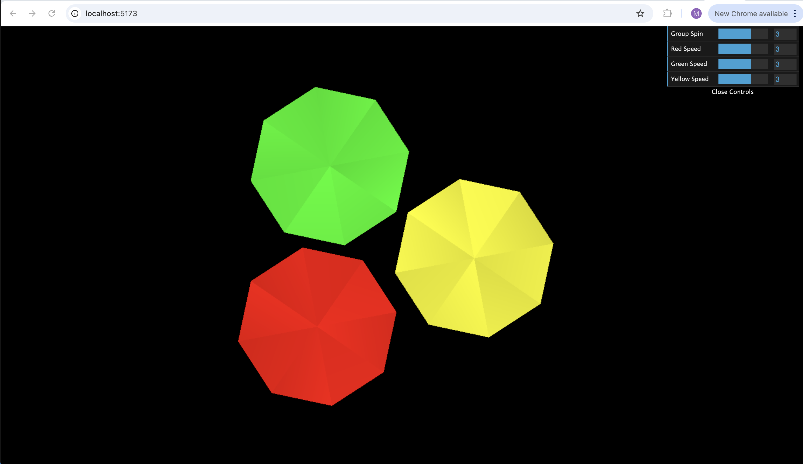

# CSI4130 Assignment 1

February 4, 2025<br>
Mustafa Ahmed<br>
300242013<br>

This directory stores solutions to CSI4130 Assignment 1.<br>
Visit the GitHib Repository: [csi4130-a2](https://github.com/mustafa-ahmed1118/csi4130-a1.git)

## Summary of Topics:

- WebGL
  - Buffer management
  - Orthographic camera configuration using matrices
  - simple animation using the WebGL pipeline
- Three.js
  - Scene graph management
  - Orthographic camera setup
  - Simple animation using Three.js groupings

## Project File Structure:

```
A1_300242013
│   README.md
|
└───Images
│   │   Q1_Screenshot.png
│   │   Q2_Screenshot.png
│   │
└───Q1
│   │   tetrahedrons.html
│   │   tetrahedrons.js
│   │
│   └–––lib
│       │   cuon-matrix.js
│       │   cuon-utils.js
|       |   geometry.js
|       |   gl-matrix.js
|       |   webgl-debug.js
|       |   webgl-utils.js
|    |
|    └––shaders
|       |   tetrahedron.fs
|       |   tetrahedron.vs
|       |
└───Q2
    │   index.html
    │   tetrahedron_three.js
```

## Requirments:

- Python 3 to run a local host server or any equivalent.
- Node.js version 14 or later.

### Ensure the following node libraries are installed:

1. Three.js

   ```bash
   npm install --save three
   ```

2. Vite

   ```bash
   npm install --save-dev vite
   ```

3. Dat GUI
   ```bash
   npm install dat.gui --save-dev
   ```

## Question 1: WebGL Octahedrons

The solution to this problem is in the `Q1/` directory. In Question 1, three octahedrons were animated to spin individually and as a group around the center of the frustum. This solution was heavily inspired by Lab 1. With that in mind, it was adapted to animate the three octahedrons using a list of three VAO objects.<br>

The octahedrons were constructed by extending the vertices of the tetrahedron from Lab 1. Essentially, each was formed by combining two tetrahedrons. For better organization, the interleaved vertex and RGB values of each octahedron were stored in the `Q1/lib/geometry.js` file.<br>

All the libraries from Lab 1 were reused in `Q1/lib`. The shaders from Lab 1 were also carried over and stored in the `Q1/shaders` directory.<br>

Admittedly, the animation is slow. I encountered issues fixing it, but the rotations perform as required.<br>

### How to Run Question 1:

1. Open your command line and navigate to the project directory.
2. navigate further to: `A1_300242013/Q1`.
3. run the project in a local server using: `python -m http.server --bind 127.0.0.1`.
4. Visit `http://127.0.0.1:8000/`.
5. In the locally hosted directoy, open the `tetrahedrons.html` file to see the animation


_Expected output for question 1._

## Question 2: Three.js Octahedrons

The solution to this problem is in the `Q2/` directory. Question 2 is similar to the first. It animates the three octahedrons using the built-in Circle geometry with a circumference of 8 to simulate an octahedron. The vertices of each octahedron has a random shade of its respective color assigned to it to make the octahedron shape more apparent. It makes for a more gem-like reflection effect on each octahedron<br>

The solution takes heavy inspiration from Lab 2, particularly in the use of the Three.js Scene Graph. Similar to Lab 2, the octahedrons are organized into a group called `tetGroup` and further enclosed in a rotation group called `tetRotGroup`. These groups are later used in the `render()` function to rotate the entire group of octahedrons around the center of the frustum while they each spin individually.<br>

The animation speed controls of lab 2 have been adjusted. It no longer controls the speed of the enire scene graph animation. There are now individual sliders to adjust the speed and direction at which each octahedron spins as well as the speed and direction the entire rotation group spins.<br>

### How to Run Question 2:

1. Using your command line navigate to the project folder and into the `A1_300242013/Q2` directory.
2. Run the project in a localhost server using the following command:
   ```bash
   npx vite
   ```
3. Visit the link provided to see the animation. For example: `http://localhost:5173/`


_Expected output for question 2._

# Sources:

- [WebGL Documentation - Creating 3D objects using WebGL](https://developer.mozilla.org/en-US/docs/Web/API/WebGL_API/Tutorial/Creating_3D_objects_using_WebGL)
- [Three.js Documentation - Installation Guide](https://threejs.org/docs/index.html#manual/en/introduction/Installation)
- [Three.js Documentation - CircleGeometry](https://threejs.org/docs/#api/en/geometries/CircleGeometry)
- [Dat GUI Installation](https://sbcode.net/threejs/dat-gui/)
- CSI41310 Lab 1
- CSI4130 Lab 2
- ChatGPT for identifying bugs - further indicated in code
